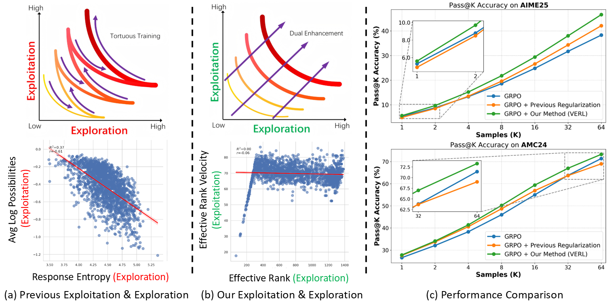

<!-- 顶部个人信息：头像 + 名片式简介 -->

  
  

    <h1>Xiao Fan (范潇)</h1>
    
1st Year D.Eng. @ Tsinghua University Interests: Test-time Adaptation, Self-Evolving Embodied Agent

    

      <a href="mailto:xiaofan140@gmail.com">xiaofan140@gmail.com</a> ·
      <a href="https://scholar.google.com/citations?user=XeFBXxYAAAAJ&hl=en" target="_blank" rel="noopener">Google Scholar</a> ·
      <a href="https://github.com/AnikiFan" target="_blank" rel="noopener">GitHub</a> ·
      <a href="assets/images/WeChat.png" target="_blank" rel="noopener">WeChat</a> ·
      <a href="https://x.com/oaa9449qUd29951" target="_blank" rel="noopener">X</a>
    

    

      <a href="assets/cv/cv.pdf" target="_blank" rel="noopener">CV</a> ·
      <a href="https://linkedin.com/in/xiao-fan-42064336b" target="_blank" rel="noopener">LinkedIn</a>
    

  

---

## Education

| Degree | Institution | Advisor | Years |
|---|---|---|---|
| B.Eng. in Data Science | Tongji University |  | 2022–2026 |
| D.Eng. in Electronic Information | Tsinghua University | [Prof. Zhi Wang](http://pages.mmlab.top/) | 2026–2031 |
<!-- | M.S. in XXX | Another University |  | 2019–2022 | --> 

---

!!! note "Recent News"
    - **[2025-09]** My personal website is launched!
    - **[2025-09]** We have released a new paper [VERL](https://hf618.github.io/VERL.github.io/) on Reinforcement Learning for reasoning LLM.
    - **[2025-11]** {==My debut paper, as the sole first author, has been accepted by AAAI 2026 (CCF-A, 17.6% overall acceptance rate)!==}
    - **[2026-04]** [VERL](https://hf618.github.io/VERL.github.io/) has been accepted as ACL 2026 Findings.
---

## Publications

> *\* equal contribution, † corresponding author.*

### 2025

!!! info ""
    { align=left width=50%}
    **Semantic-Space Exploration and Exploitation in RLVR for LLM Reasoning**  
    {{ author("huang_fan_ding") }}\*, {{ author("huang_guan_bo") }}\*, **Xiao Fan**, {{ author("he_yi") }}, {{ author("liang_xiao") }}, {{ author("chen_xiao") }}, {{ author("jiang_qin_ting") }}, {{ author("faisal_nadeem_khan") }}, {{ author("jiang_jing_yan") }}†, {{ author("wang_zhi") }}†.  
    *Accepted as ACL 2026 Findings.*  
    [[Paper]](https://openreview.net/pdf?id=HoyEcZfmdB) [[Code]](https://github.com/hf618/VERL) [[Project]](https://hf618.github.io/VERL.github.io/) [[BibTex]](https://openreview.net/forum?id=HoyEcZfmdB#)

    

    ??? abstract
        Reinforcement Learning with Verifiable Rewards (RLVR) for LLM reasoning is often framed as balancing exploration and exploitation in action space, typically operationalized with token-level proxies (e.g., output entropy or confidence). We argue that this apparent trade-off is largely a measurement artifact: token-level statistics reflect next-token uncertainty rather than how reasoning progresses over multi-token semantic structures. We therefore study exploration and exploitation in the hidden-state space of response trajectories. We use Effective Rank (ER) to quantify representational exploration and introduce its temporal derivatives, Effective Rank Velocity (ERV) and Effective Rank Acceleration (ERA), to characterize exploitative refinement dynamics. Empirically and theoretically, ER and ERV exhibit near-zero correlation in semantic space, suggesting the two capacities can be improved simultaneously. Motivated by this, we propose Velocity-Exploiting Rank Learning (VERL), which shapes the RL advantage with an auxiliary signal derived from ER/ERV and uses the more stable ERA as a meta-control variable to adaptively balance the incentives. Across multiple base models, RL algorithms, and reasoning benchmarks, VERL yields consistent improvements, including large gains on challenging tasks (e.g., 21.4% in Gaokao 2024).

<!-- TODO: change bibtex url to dblp link!!! -->

### 2026

!!! info ""
    { align=left width=50%}

    **MoETTA: Test-Time Adaptation Under Mixed Distribution Shifts with MoE-LayerNorm**  
    **Xiao Fan**, {{ author("jiang_jing_yan") }}†, {{ author("chen_zhao_ru") }}, {{ author("huang_fan_ding") }}, {{ author("chen_xiao") }}, {{ author("jiang_qin_ting")}}, {{ author("zhang_bo_wen") }}, {{ author("tang_xing") }}, {{ author("wang_zhi") }}.  
    {==*Accepted by AAAI 2026 (CCF-A, 17.6% overall acceptance rate).*==}  
    [[Paper]](https://arxiv.org/abs/2511.13760v1) [[Code]](https://github.com/AnikiFan/MoETTA) <!--[[project]](https://yourdomain.example/project-a)--> [[BibTex]](https://dblp.org/rec/conf/aaai/FanJCHCJZTW26.bib?param=1) [[Poster]](assets/poster/AAAI2026.pdf)

    

    ??? abstract
        Test-Time Adaptation (TTA) has proven effective in mitigating performance drops under single-domain distribution shifts by updating model parameters during inference. However, real-world deployments often involve mixed distribution shifts, where test samples are affected by diverse and potentially conflicting domain factors, posing significant challenges even for state-of-the-art TTA methods. A key limitation in existing approaches is their reliance on a unified adaptation path, which fails to account for the fact that optimal gradient directions can vary significantly across different domains. Moreover, current benchmarks focus only on synthetic or homogeneous shifts, failing to capture the complexity of real-world heterogeneous mixed distribution shifts.
        To address this, we propose **MoETTA**, a novel entropy-based TTA framework that integrates the Mixture-of-Experts (MoE) architecture. Rather than enforcing a single parameter update rule for all test samples, MoETTA introduces a set of structurally decoupled experts, enabling adaptation along diverse gradient directions. This design allows the model to better accommodate heterogeneous shifts through flexible and disentangled parameter updates.
        To simulate realistic deployment conditions, we introduce two new benchmarks: *potpourri* and *potpourri+*. While classical settings focus solely on synthetic corruptions (i.e., ImageNet-C), potpourri encompasses a broader range of domain shifts—including natural, artistic, and adversarial distortions—capturing more realistic deployment challenges. Additionally, potpourri+ further includes source-domain samples to evaluate robustness against catastrophic forgetting.
        Extensive experiments across three mixed distribution shifts settings show that MoETTA consistently outperforms strong baselines, establishing new state-of-the-art performance and highlighting the benefit of modeling multiple adaptation directions via expert-level diversity.

<!-- TODO: change project url!!! -->

<!--
2. **Paper Title B**  
   Your Name, Collaborator C†.  
   *Journal 2025.* [[paper]](https://doi.org/xxx) -->

---

## Projects

- **I promise I will soon organize and share my past projects.**

---

## Service

- **Sadly, nothing to serve yet.**

