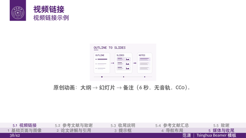

# campus-beamer

[`campus-beamer`](https://github.com/AnikiFan/campus-beamer) is an agent-oriented system for creating academic presentations with LaTeX Beamer. It is designed around a simple question: what should an academic presentation workflow look like when an AI agent is helping to create, revise, and maintain the slides?

{ width=100% }

## Motivation

An agent can produce a deck quickly, but a directly generated PPT often has problems that are easy to miss until the presentation is ready: font sizes drift from slide to slide, the visual language does not feel academic, citations are handled inconsistently, and useful decisions are difficult to carry into the next presentation. The result may look complete while remaining hard to review, revise, or accumulate as a long-term research asset.

`campus-beamer` treats presentation generation as a structured, repeatable process instead of a one-off drawing task. A reusable Beamer foundation gives the agent stable layout constraints and gives the author a source that can be inspected, edited, and extended over time. The aim is to preserve the speed of agent assistance without giving up academic readability, provenance, or reuse.

## What it improves

- **More consistent slides.** Shared typography and layout rules reduce font-size drift and keep the visual hierarchy coherent across a deck.
- **A stronger academic style.** Presentation structure is guided by conventions for research communication rather than by whatever layout happens to be generated for one slide.
- **Accumulation over time.** Source-based slides, comments, and reusable components make it easier to review an agent's work, refine it, and carry the result into future talks.
- **Better links and references.** Hyperlinks remain available in the exported presentation, so a talk can still connect claims, papers, and supporting material to their sources.

## Optimized for real use

The project also addresses the details that matter when a generated deck leaves the editor and enters a real academic workflow:

- presentations can be exported to **PPTX**, with slides preserved as rendered images and speaker notes available in PowerPoint;
- **comments** can stay with the source, making review and later revision easier;
- slide **jump links** are preserved for navigating between related sections and references;
- paper metadata can be looked up through **DBLP** for BibTeX entries, while citation counts can be checked as part of reference preparation.

## Why it matters in the AI era

The value of an academic presentation is not only that it can be produced once. It should remain readable to people, legible to agents, and useful as a foundation for the next presentation. By combining agent assistance with explicit structure, source-level traceability, and practical export and reference tooling, `campus-beamer` explores a more durable model for AI-assisted academic communication.

The source code, examples, and usage details are maintained in the [GitHub repository](https://github.com/AnikiFan/campus-beamer).
